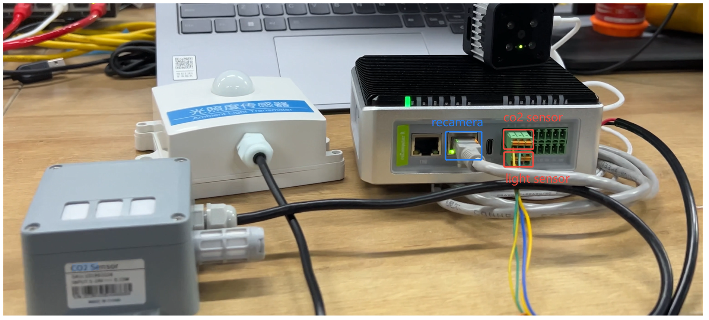
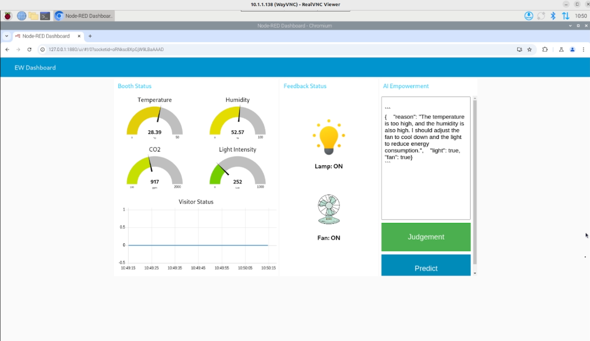

# Smart-Home-RAG-Assistant
This project collects data on temperature, humidity, light intensity, and the number of people in an area to form a database. It leverages the Qwen2.5 large language model (LLM) to analyze this data and determine whether to turn lights and fans on or off.

## Hardware Preparation

|                                               SenseCAP CO2, Temperature and Humidity Sensor                                                |  reCamera 2002 64GB|                                             reComputer R1100                                               |
| :----------------------------------------------------------------------------------------------------------------: | :----------------------------------------------------------------------------------------------------------------: | :-----------------------------------------------------------------------------------------------------------: |
|  |  |  |
| [**Purchase Now**](https://www.seeedstudio.com/SenseCAP-CO2-Temperature-and-Humidity-Sensor-with-RS485-SDI-12-p-5720.html?qid=eyJjX3NlYXJjaF9xdWVyeSI6IlRlbXBlcmF0dXJlJTIwYW5kJTIwSHVtaWRpdHklMjBTZW5zb3IiLCJjX3NlYXJjaF9yZXN1bHRfcG9zIjozLCJjX3RvdGFsX3Jlc3VsdHMiOjEwMSwiY19zZWFyY2hfcmVzdWx0X3R5cGUiOiJQcm9kdWN0IiwiY19zZWFyY2hfZmlsdGVycyI6InN0b3JlQ29kZTpbcmV0YWlsZXJdIn0%3D?utm_source=PiAICourse&utm_medium=github&utm_campaign=Course)|[**Purchase Now**](https://www.seeedstudio.com/reCamera-2002-64GB-p-6252.htmlqid=eyJjX3NlYXJjaF9xdWVyeSI6InJlY2FtZXJhIiwiY19zZWFyY2hfcmVzdWx0X3BvcyI6MSwiY190b3RhbF9yZXN1bHRzIjo0LCJjX3NlYXJjaF9yZXN1bHRfdHlwZSI6IlByb2R1Y3QiLCJjX3NlYXJjaF9maWx0ZXJzIjoic3RvcmVDb2RlOltyZXRhaWxlcl0ifQ%3D%3D?utm_source=PiAICourse&utm_medium=github&utm_campaign=Course) | [**Purchase Now**](https://www.seeedstudio.com/reComputer-R1125-10-p-6256.html?utm_source=PiAICourse&utm_medium=github&utm_campaign=Course) |


## Hardware connection



## Install node-red

```
bash <(curl -sL https://raw.githubusercontent.com/node-red/linux-installers/master/deb/update-nodejs-and-nodered)
sudo systemctl restart nodered.service 
sudo systemctl enable nodered.service 
```

## Install project

```
git clone https://github.com/Seeed-Projects/Smart-Home-RAG-Assistant.git
```

## Prepare environment

```
cd Smart-Home-RAG-Assistant
python -m venv .env 
source .env/bin/activate
pip install -r requirements
```

## Run RAG and http service

```
uvicorn http_service:app --host 0.0.0.0 --port 8000 --reload
python rag.py
```

## Import the workflow into Node-RED

>### Note: Please refer this [link](https://umh.docs.umh.app/docs/production-guide/backup_recovery/import-export-node-red-flows/) to import your workflow to Node-RED


```
cd nodered-flow
ls
```
There are two Node-RED flow here, `recomputer-work-flow.json` is the workflow you deploy on reComputer R1100, and `recamer-work-flow.json` is the workflow you deploy on recamre.

## Result

The dashboard of this project is show as below:



